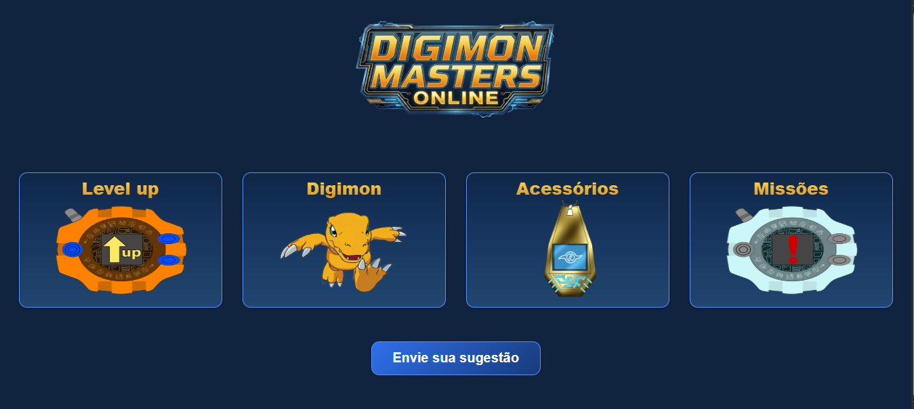
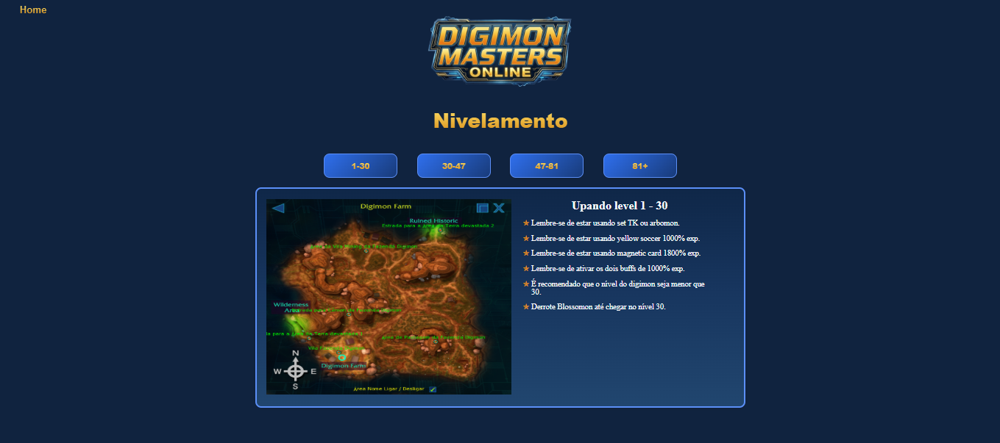
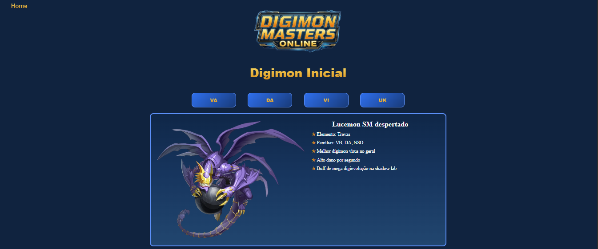
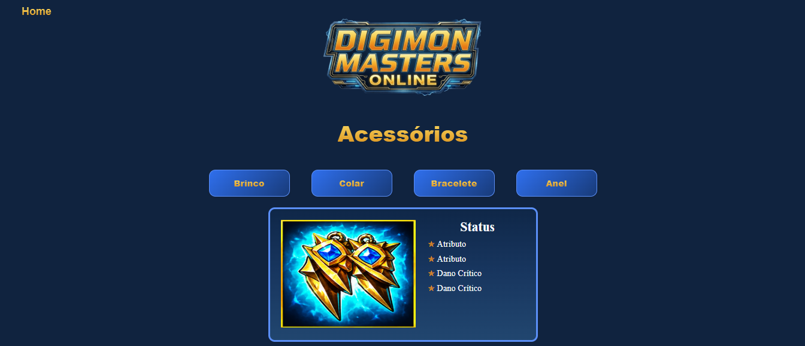
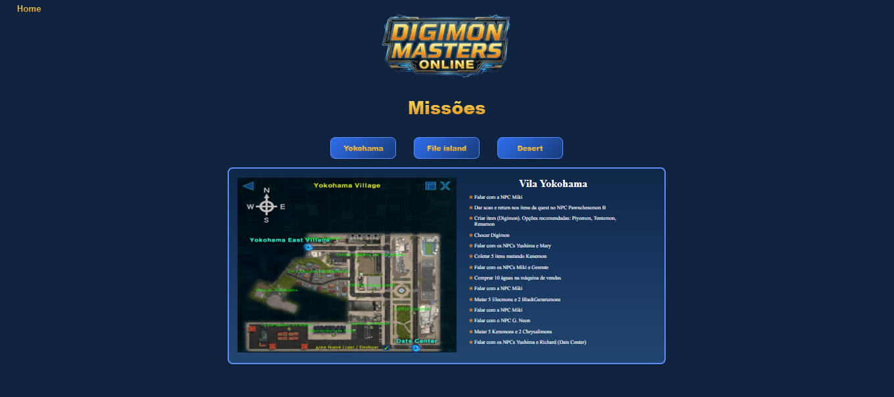

# 🎮 Guia de Progressão - Digimon

Este projeto é um site informativo desenvolvido com HTML, CSS e JavaScript com o objetivo de auxiliar jogadores na progressão dentro do universo Digimon. O site reúne informações organizadas sobre evolução de personagens, locais de treinamento, acessórios, missões e Digimons, proporcionando uma navegação simples e intuitiva.

## 💻 Tecnologias

- HTML5
- CSS3
- JavaScript (ES6)

## ⚙️ Instalação

- Baixe ou clone este repositório.
- Abra a pasta do projeto.
- Execute o arquivo index.html em qualquer navegador moderno.

## 🛠️ Funcionalidades

O site possui diferentes páginas para facilitar a consulta das informações:

| 📄 Página | 📋 Descrição |
| :--- | :--- |
| **Página Inicial** | Menu principal com acesso às demais áreas do site. |
| **Level Up** | Guia com sugestões de locais para evolução de acordo com o nível do digimon. |
| **Digimon** | Lista organizada de Digimons separados por atributos. |
| **Acessórios** | Catálogo de acessórios organizados por categoria. |
| **Missões** | Guia de missões dividido por regiões do jogo. |

Além disso, o projeto conta com:

- Interface totalmente baseada em navegação por menus.
- Exibição dinâmica de conteúdo utilizando JavaScript.
- Organização das informações em categorias.
- Layout simples e responsivo.
- Utilização de imagens ilustrativas para melhorar a experiência do usuário.

## 🕹️ Como utilizar

1. Abra o arquivo index.html.
2. Escolha uma das opções disponíveis no menu principal.
3. Navegue entre as categorias utilizando os botões da página.
4. Consulte as informações desejadas sobre Digimons, acessórios, missões ou locais para evolução.
5. Retorne ao menu principal para acessar outras seções do site.

## 🚀 Possíveis melhorias

- Criar modo light.
- Consumir dados através de uma API ou arquivo JSON.
- Tornar o layout totalmente responsivo para dispositivos móveis.
- Disponibilizar versão em inglês.

## 💡 Exemplo de uso

1. Selecione uma das opções disponíveis no menu da página principal. OBS: O campo de enviar sugestões é meramente ilustrativa.

  

2. Selecione uma das opções disponíveis no menu da página de nivelamento ou clique em Home para ir à página principal

3. Selecione uma das opções disponíveis no menu da página de digimons ou clique em Home para ir à página principal

4. Selecione uma das opções disponíveis no menu da página de acessórios ou clique em Home para ir à página principal

5. Selecione uma das opções disponíveis no menu da página de missões ou clique em Home para ir à página principal

## 🚀 Status do Projeto

✅ Concluído

## 👤 Autor

Feito por Matheus Felipe Claudino de Santana

GitHub: https://github.com/matheuscsantana-arch
